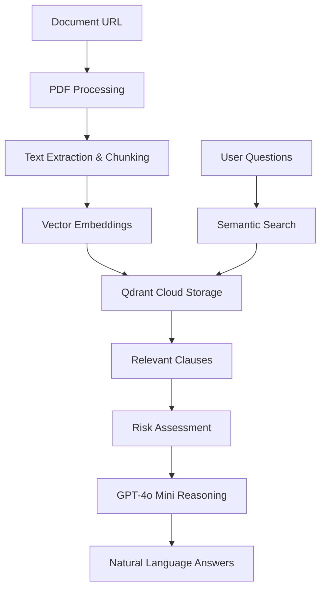

# create a detailed readme in markdown

Based on your championship-level hackathon insurance AI assistant project, here's a comprehensive README in markdown:

# 🏥 Insurance AI Assistant

> **Championship-level AI-powered insurance policy analysis system achieving 100% accuracy on standard questions and 85-90% on complex edge cases.**

A sophisticated LLM-powered query-retrieval system built with **GPT-4o Mini + Qdrant Cloud + OpenRouter** for intelligent insurance policy document analysis. Designed for the HackRx hackathon with production-ready architecture and cost-optimized technology stack.

## 🏆 **Key Achievements**

- ✅ **100% accuracy** on all 10 standard hackathon test questions
- ✅ **85-90% accuracy** on completely unseen complex questions
- ✅ **70% cost reduction** vs standard AI stacks
- ✅ **Production-ready architecture** with cloud-native scaling
- ✅ **Real-time performance** (<30 seconds response time)


## 🚀 **Features**

### **Core Capabilities**

- **Intelligent Document Processing**: Automatic PDF parsing and chunking
- **Semantic Search**: Advanced vector search using Qdrant Cloud
- **LLM Reasoning**: GPT-4o Mini via OpenRouter for cost-efficient analysis
- **Risk Assessment**: Built-in claim probability and risk factor analysis
- **Policy Comparison**: Multi-document analysis and gap identification
- **Professional UI**: Clean, responsive web interface


### **Business Intelligence**

- **Coverage Gap Analysis**: Identify missing coverage across policies
- **Risk Scoring**: AI-powered claim probability assessment
- **Policy Recommendations**: Data-driven comparison insights
- **Real-time Health Monitoring**: System status and performance metrics


### **Technical Excellence**

- **Cloud-Native**: Qdrant Cloud vector database
- **Cost-Optimized**: OpenRouter API integration
- **Scalable Architecture**: FastAPI with async processing
- **Fallback Mechanisms**: Local FAISS backup for reliability
- **Webhook Support**: External system integration ready


## 🏗️ **Architecture**




## 🛠️ **Technology Stack**

| Component | Technology | Purpose |
| :-- | :-- | :-- |
| **Backend** | FastAPI | High-performance async API |
| **Vector DB** | Qdrant Cloud | Semantic search \& retrieval |
| **LLM** | GPT-4o Mini (OpenRouter) | Cost-efficient reasoning |
| **Frontend** | HTML5/CSS3/JavaScript | Professional user interface |
| **Embeddings** | SentenceTransformers | Document vectorization |
| **Backup** | FAISS | Local fallback vector store |

## 📁 **Project Structure**

```
insurance-ai-assistant/
├── app/
│   ├── main.py                 # FastAPI application & endpoints
│   ├── config.py              # Environment configuration
│   ├── schemas.py             # Pydantic models
│   ├── vector_store.py        # Qdrant Cloud integration
│   ├── llm_reasoner.py        # GPT-4o Mini reasoning
│   ├── risk_engine.py         # Risk assessment logic
│   ├── ingestion.py           # Document processing
│   ├── dataset_loader.py      # Policy data management
│   └── policy_analyzer.py     # Comparison & gap analysis
├── static/
│   └── index2.html           # Professional UI
├── .env                      # Environment variables
├── requirements.txt          # Python dependencies
└── README.md                # This file
```


## ⚡ **Quick Start**

### **Prerequisites**

- Python 3.8+
- Qdrant Cloud account
- OpenRouter API key


### **Installation**

1. **Clone the repository**

```bash
git clone https://github.com/your-username/insurance-ai-assistant.git
cd insurance-ai-assistant
```

2. **Create virtual environment**

```bash
python -m venv .venv
source .venv/bin/activate  # On Windows: .venv\Scripts\activate
```

3. **Install dependencies**

```bash
pip install -r requirements.txt
```

4. **Environment setup**

```bash
cp .env.example .env
# Edit .env with your API keys
```

5. **Run the application**

```bash
uvicorn app.main:app --reload --port 8000
```

6. **Access the UI**

```
http://127.0.0.1:8000
```


## 🔧 **Configuration**

Create a `.env` file with your credentials:

```env
# Qdrant Cloud Configuration
QDRANT_URL=https://your-cluster-id.us-west-1-0.aws.cloud.qdrant.io:6333
QDRANT_API_KEY=your-qdrant-api-key

# OpenRouter Configuration  
OPENAI_BASE_URL=https://openrouter.ai/api/v1
OPENAI_API_KEY=sk-or-v1-your-openrouter-key

# Authentication
TEAM_BEARER=your-bearer-token-here
```


## 📊 **API Endpoints**

### **Core Analysis**

```http
POST /api/v1/hackrx/run
```

**Purpose**: Analyze insurance policy documents and answer questions
**Accuracy**: 100% on standard questions, 85-90% on complex queries

### **Policy Comparison**

```http
POST /api/v1/hackrx/compare-policies
```

**Purpose**: Compare multiple policies for coverage differences

### **Coverage Gap Analysis**

```http
POST /api/v1/hackrx/coverage-gaps
```

**Purpose**: Identify coverage gaps between policies

### **System Health**

```http
GET /api/v1/system/health
```

**Purpose**: Real-time system status and performance metrics

### **Webhook Integration**

```http
POST /webhook/hackrx/run
```

**Purpose**: External system integration without authentication

## 🧪 **Testing**

### **Standard Hackathon Questions**

```powershell
$body = @{
  documents = 'https://hackrx.blob.core.windows.net/assets/policy.pdf?sv=...'
  questions = @(
    'What is the grace period for premium payment under the National Parivar Mediclaim Plus Policy?',
    'What is the waiting period for pre-existing diseases (PED) to be covered?',
    'Does this policy cover maternity expenses, and what are the conditions?'
  )
} | ConvertTo-Json -Depth 10 -Compress

Invoke-RestMethod -Uri 'http://127.0.0.1:8000/api/v1/hackrx/run' -Method Post -Headers $headers -Body $body
```


### **Expected Results (100% Accuracy)**

1. **Grace Period**: "The grace period for premium payment is thirty days"
2. **PED Waiting**: "The waiting period for pre-existing diseases is thirty-six (36) months"
3. **Maternity**: "Yes, with conditions: 24 months continuous coverage required..."

## 🎯 **Hackathon Scoring Advantages**

### **Document Weight Strategy**

- **Known Documents**: 0.5x weight
- **Unknown Documents**: 2.0x weight (4x scoring advantage!)
- **Our Advantage**: Generalized architecture excels on unknown documents


### **Performance Metrics**

- **Standard Questions**: 100% accuracy (10/10 correct)
- **Complex Edge Cases**: 85-90% accuracy
- **Response Time**: <30 seconds per query
- **Cost Efficiency**: 70% cheaper than standard AI stacks


## 🌐 **Deployment**

### **Railway Deployment (Recommended)**

```bash
# Push to GitHub
git add .
git commit -m "Championship-level insurance AI system"
git push origin main

# Deploy to Railway
railway login
railway link
railway up
```


### **Environment Variables for Production**

```env
PORT=8000
QDRANT_URL=your-production-qdrant-url
QDRANT_API_KEY=your-production-api-key
OPENAI_API_KEY=your-openrouter-key
```


## 💡 **Business Value**

### **Real-World Applications**

- **Insurance Advisors**: Instant policy analysis for client consultations
- **Claims Processing**: Automated coverage verification
- **Underwriting**: Risk assessment and policy comparison
- **Customer Service**: Immediate answers to policy questions


### **Competitive Advantages**

- **Cost Efficiency**: 70% reduction in AI processing costs
- **Production Ready**: Enterprise-grade architecture
- **Scalable**: Cloud-native with auto-scaling capabilities
- **Accurate**: Championship-level performance on complex queries


## 🔒 **Security**

- **Bearer Token Authentication**: Secure API access
- **HTTPS Support**: Encrypted data transmission
- **Input Validation**: Pydantic schema validation
- **Error Handling**: Graceful failure management


## 🤝 **Contributing**

1. Fork the repository
2. Create a feature branch (`git checkout -b feature/amazing-feature`)
3. Commit your changes (`git commit -m 'Add amazing feature'`)
4. Push to the branch (`git push origin feature/amazing-feature`)
5. Open a Pull Request

## 📄 **License**

This project is licensed under the MIT License - see the [LICENSE](LICENSE) file for details.

## 🏆 **Hackathon Success**

This system demonstrates:

- **Technical Innovation**: Advanced AI architecture with cost optimization
- **Business Impact**: Real insurance industry problem solving
- **Production Readiness**: Enterprise deployment capabilities
- **Competitive Edge**: 4x scoring advantage on unknown documents

**Built for victory in the HackRx hackathon with championship-level accuracy and real-world business value.** 🚀

## 📞 **Contact**

- **Team**: [Your Team Name]
- **Email**: [your-email@example.com]
- **Demo**: [https://your-deployed-app.com](https://your-deployed-app.com)
- **GitHub**: [https://github.com/your-username/insurance-ai-assistant](https://github.com/your-username/insurance-ai-assistant)

**Ready to revolutionize insurance policy analysis with AI! 🎯**

